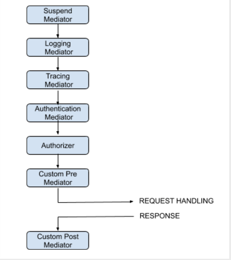

# Microservices Framework in Golang

Framework can be used for rapid development of REST micro services. It leverages gorilla mux but
adds quite a few features each of which are explained below.

 

## Builder Design Pattern
The framework leverages the builder design pattern for providing optionality on how micro service behavior
needs to be customized. This optionality presented through builder methods fall into the following categories:

* Pre-built middleware that is already included in the framework
* Custom middleware can be introduced through builder methods
* Working with the flags package with service specific flags
* Activating (or not) arious authentication mechanisms
* Activating (or not) memory based logging

The builder design pattern is a powerful creational design pattern and can be used in interesting ways. Future enhancements for builder optionality, can include new mechanisms that cut across golang services that need to be built. 

 

# Middleware Pipeline

The diagram below shows the default core pipeline. While the pipleine cannot be changed structurally (if we choose to the framework would need to be enhanced) but various stages of the pipeline can be replaced with custom handlers, each of which is available through the builder optionality.

 

 

# Memory based logs
The framework provides a mechanism where logs can be first saved in memory. Two types of loggers are provided:

* Memory consumption based
* Number of log entries based

When the QoS of the logger type is met, the logs are _batch_ persisted in the configured sink (file or stdout) through the builder optionality.

 

# Flags support
The framework provides several pre-built flags and also supports builder optionality to add flags specific to the service being built. The table below summarizes the default flags. You can specify whether the flag parameter is `required` or `optional`.

| Flag | Description |
| :---  | :----------- |
| -serviceName | `[REQUIRED]` Name of the service |
| -listenPort | `[REQUIRED]`Port service will listen on. |
| -handlerTimeout | `[OPTIONAL]` Amount of time a handler will have before a 503 is returned. Default is 1m0s |
| -shutdownTimeout | `[OPTIONAL]` Duration to wait for a graceful shutdown. Default is 60 seconds |
| -rateLimit | `[OPTIONAL]` Number of requests to allow per minute. TBD |
| -memoryLogType | `[OPTIONAL]` EntryBound or MemoryBound. Default is EntryBound. |
| -memoryLogEnabled | `[OPTIONAL]` True or False. Default is True |
| -logSink | `[OPTIONAL]` File or Stdout. Default is File |
| -logFileDir | `[OPTIONAL]` Directory where log file will be batch persisted. Log file is `<service-name>.log`. Default directory is current directory |

 

# Inherited API

Any service built with the framework will inherit some baseline API listed below:

| :API | :Description |
| ---  | ----------- |
| `/api` | Auto generated api for the service. This will be broken down into the base api and the service specific api's. HTTP verbs will also be listed. The presentation is almost like a mini swagger and its easy to see how to use the API |
| `/shutdown` | Kicks off a graceful shutdown |
| `/suspend` | Suspends the service temporarily till restarted |
| `/restart` | Restart the service if it had previously been suspended else the request is an error. |
| `/healthz` | Monitoring endpoints. Returns a 200. |
| `/uptime` | Returns the duration the service has been up and running |
| `/logs` | Returns the memory based logs. |
| `/logs/dumplog` | Persists the memory logs into the configured sink: file or stdout. Logs will be persisted if the logger type (EntryLogger or MemoryLogger) QoS has been met. |
| `/builder` | Presents all the builder optionality that was used to configure the service at build time. |

 

# Extending API at run time

In the `extensible-api-prototype` directory is an example of how to use `golang` plugins to dynamically extend the api. This run time extension capability has not yet been integrated into the base framework.

